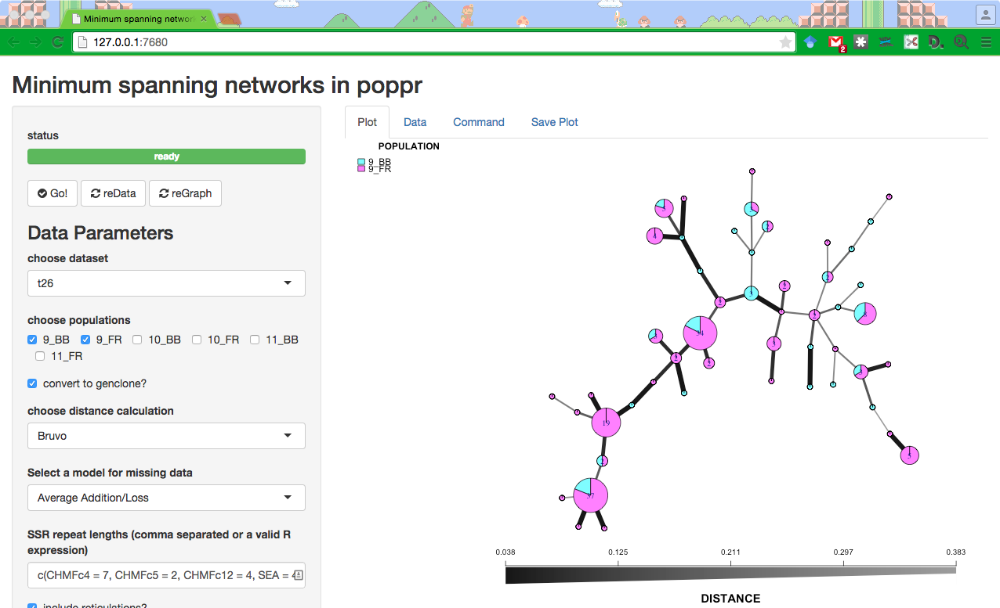

# Shiny App for minimum spanning networks in poppr

## UPDATE: moved to [poppr](https://github.com/grunwaldlab/poppr/tree/2.0-rc)!

This has been moved to poppr 2.0 and is available by using:

```R
devtools::install_github("thibautjombart/adegenet") # requires adegenet 2.0
devtools::install_github("grunwaldlab/poppr@2.0-rc")
poppr::imsn()
```

For the example below:

```R
# Set up data
library("poppr")
library("magrittr")
data(monpop)
splitStrata(monpop) <- ~Tree/Year/Symptom
summary(monpop)
t26 <- monpop %>% setPop(~Tree) %>% popsub("26") %>% setPop(~Year/Symptom)
t26
imsn()
```

## Old README

This repository contains a shiny application that will create and display minimum spanning networks via the poppr R package. This provides a simple way of exploring visualization of these networks with your own data.

It is recommended to use poppr version 2.0 for this. It is still in development. You can install it via github:

```R
devtools::install_github("thibautjombart/adegenet") # requires adegenet 2.0
devtools::install_github("grunwaldlab/poppr@2.0-rc")
```


For an example, you can use the example from the [minimum spanning network](http://grunwaldlab.github.io/Population_Genetics_in_R/Pop_Structure.html#minimum-spanning-network) section of our primer to prepare data for exploratory visualization.

To run this application you should have installed shiny and poppr. After that you can use the following line to run the instance and a window will open in your browser.

```R
shiny::runGitHub("zkamvar/poppr_msn_shiny")
```

### Screencapture



To reproduce the screencapture above:

```R
# Set up data
library("poppr")
library("magrittr")
data(monpop)
splitStrata(monpop) <- ~Tree/Year/Symptom
summary(monpop)
t26 <- monpop %>% setPop(~Tree) %>% popsub("26") %>% setPop(~Year/Symptom)
t26
shiny::runGitHub("zkamvar/poppr_msn_shiny")
```

Choose the `t26` data set at the bottom and then copy and paste this into the
"SSR repeat lengths" input box after selecting "Bruvo" as  the distance 
calculation:
 
```R
c(CHMFc4 = 7, CHMFc5 = 2, CHMFc12 = 4, SEA = 4, SED = 4, SEE = 2, SEG = 6, SEI = 3, SEL = 4, SEN = 2, SEP = 4, SEQ = 2, SER = 4)
```

## UPDATE! 
> igraph has updated versions to 1.0 and changed the way graphs are plotted. This means that the layout you get with
> a given seed value will not be the same as in previous version of igraph.

### If your igraph version is < 1.0.0:

- Distance calculation: Bruvo
- Populations: `9_BB`, `9_FR`
- Node scale: 1.25
- Color Palette: `cm.colors`
- Labels: none
- Random Seed: 9001

### If your igraph version is >= 1.0.0:

- Distance calculation: Bruvo
- Populations: `9_BB`, `9_FR`
- Node scale: 1.45
- Color Palette: `cm.colors`
- Labels: none
- Random Seed: 99
